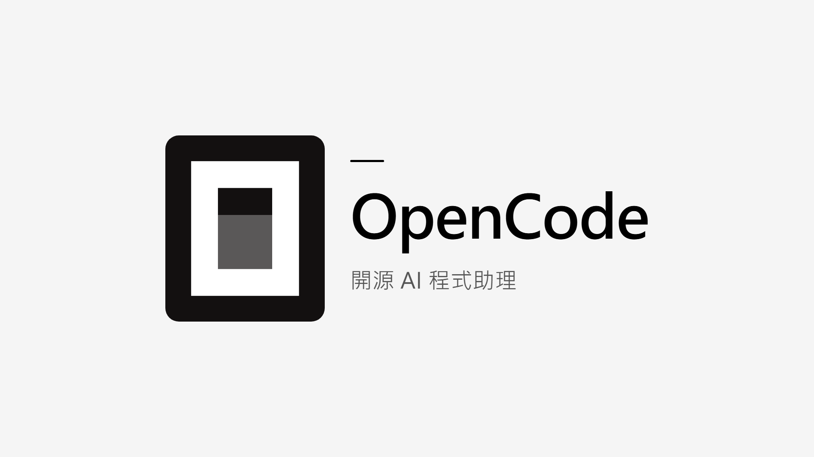
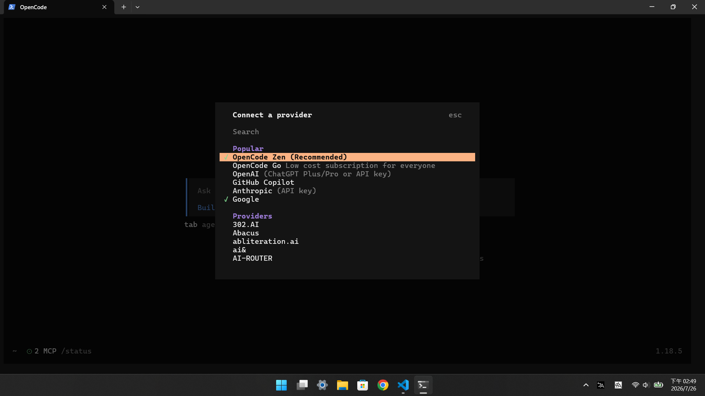
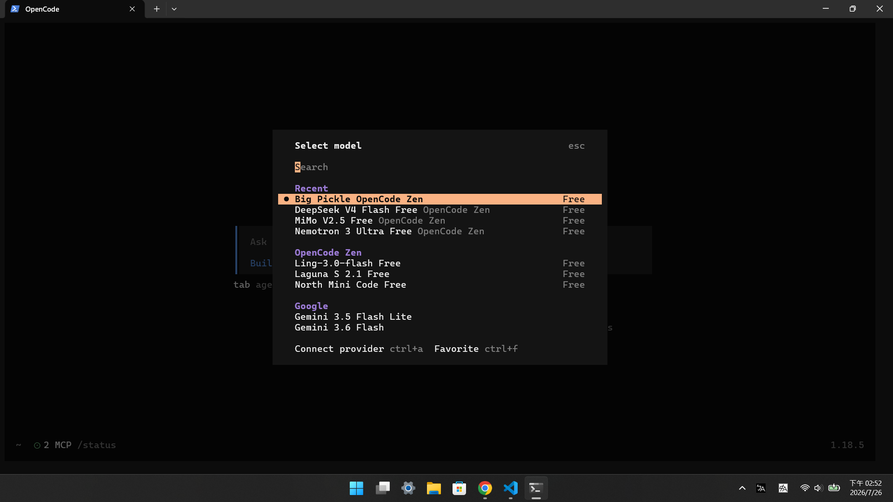
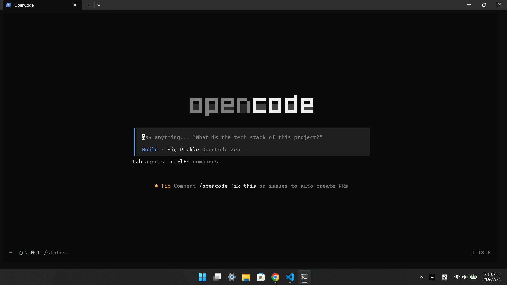
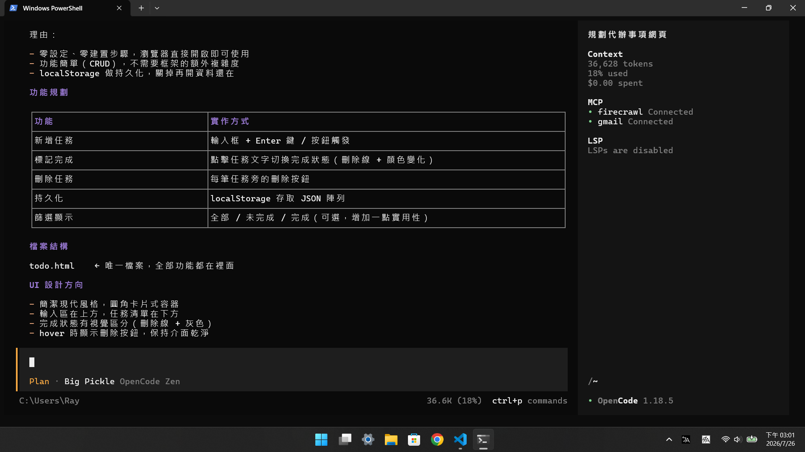

## 什麼是 OpenCode？

OpenCode 是一個免費的 AI 助手，直接在你的電腦終端機（命令列視窗）中運作。它能幫你寫程式、回答技術問題、修改檔案，甚至從零建立一個專案。

與其他付費 AI 工具不同，OpenCode 完全免費且開源，GitHub 上累積超過 19 萬顆星。它支援 75 種以上的 AI 模型，包括 OpenAI、Anthropic、Google Gemini，以及多種免費模型方案。

OpenCode 提供三種使用方式：終端機介面、桌面應用程式，以及 IDE 擴充套件。本篇教學以終端機為主，因為這是最直接、最輕量的使用方式。

## 安裝 OpenCode

OpenCode 提供多種安裝方式，選擇最適合你作業系統的方法：

### macOS / Linux

```bash
curl -fsSL https://opencode.ai/install | bash
```

一行指令搞定，不需要事先安裝任何東西。

### Windows

Windows 沒有一鍵安裝腳本，你需要先安裝一個套件管理器。以下三選一：

**使用 Winget（Windows 10/11 內建，推薦）：**

```powershell
winget install anomalyco.opencode
```

**使用 Scoop：**

```powershell
scoop install opencode
```

**使用 Chocolatey：**

```powershell
choco install opencode
```

### 驗證安裝

安裝完成後，打開終端機輸入以下指令確認：

```bash
opencode --version
```

如果看到版本號輸出，代表安裝成功。

## 選擇 AI 模型：OpenCode Zen 免費方案

安裝完成後，下一步是選擇一個 AI 模型。OpenCode 支援多種付費模型（GPT、Claude、Gemini），但對新手來說，最簡單的起點是 **OpenCode Zen** 提供的免費模型。

### 什麼是 OpenCode Zen？

OpenCode Zen 是 OpenCode 團隊提供的免費 AI 模型服務。它已經幫你選好最適合的模型，你不需要自己去比較哪個好用。

### 7 款免費模型

OpenCode Zen 目前提供以下 **完全免費** 的模型：

| 模型 | 特色 |
|------|------|
| **DeepSeek V4 Flash Free** | 速度快 |
| **MiMo-V2.5 Free** | 通用型 |
| **Laguna S 2.1 Free** | 穩定 |
| **Ling-3.0-flash Free** | 輕量快速 |
| **North Mini Code Free** | 程式碼優化 |
| **Nemotron 3 Ultra Free** | NVIDIA 提供 |
| **Big Pickle** | 神秘模型，免費體驗中 |

> **注意：** 免費模型在免費期間，收集的資料可能會被用於模型訓練。請勿在免費模型中提交機密或個人資料。

### 串接 OpenCode Zen

串接步驟非常簡單：

**步驟一：執行連線指令**

啟動 OpenCode 後，輸入：

```
/connect
```

**步驟二：選擇 OpenCode Zen**

在彈出的選單中選擇 `opencode`，然後前往 [opencode.ai/auth](https://opencode.ai/auth) 註冊帳號。




**步驟三：取得 API Key**

在 OpenCode Zen 網站上登入、建立 API Key，複製你的 API Key。

**步驟四：貼上 API Key**

回到終端機，將 API Key 貼上並確認。

**步驟五：選擇模型**

執行以下指令查看可用的免費模型：

```
/models
```

選擇一個免費模型（名稱中帶有 `Free` 的就是），就可以開始使用了。



## 啟動你的第一個對話

安裝並設定好模型後，讓我們來開始使用 OpenCode。

### 步驟一：開啟你的資料夾

打開你想要工作的資料夾（例如桌面或文件），在空白處按右鍵，選擇「在終端機中開啟」。

### 步驟二：啟動 OpenCode

在終端機中輸入：

```bash
opencode
```

你會看到一個漂亮的終端機介面，準備好幫你了。



### 步驟三：開始對話

直接用自然語言提問，OpenCode 會自動理解你的需求：

```
幫我建立一個簡單的個人網站，要有首頁和關於我兩個頁面
```

OpenCode 會自動分析需求、規劃步驟、建立檔案，你只需要確認就好。

## 基本操作教學

### 規劃模式 vs 執行模式

OpenCode 有兩種模式，用 **Tab** 鍵切換：

| 模式 | 功能 | 適合場景 |
|------|------|----------|
| **規劃模式** | 只分析和規劃，不實際修改 | 先確認方向 |
| **執行模式** | 直接建立或修改檔案 | 確認後開始做 |

**使用建議：** 先用規劃模式確認方向，再切換到執行模式。這能避免 AI 做出不符合預期的修改。

### 撤銷與重做

如果不滿意修改結果，隨時可以用指令撤銷：

```
/undo
```

想重新執行撤銷的操作：

```
/redo
```

### MCP 伺服器

**什麼是 MCP 伺服器？**

MCP（Model Context Protocol）是一種讓 AI 連接外部工具的協定。你可以把它想像成「外掛」——讓 OpenCode 能連接別的軟體，例如：Gmail、雲端硬碟等。

以下示範如何串接官方的 **Memory** 伺服器，讓 OpenCode 跨對話記住你的資訊（偏好、決策紀錄等）。

**你不需要手動編輯設定檔。** 直接在對話中告訴 OpenCode：

```
幫我串接 Memory MCP 伺服器：https://github.com/modelcontextprotocol/servers/tree/main/src/memory
```

OpenCode 會自動完成設定。串接完成後，你可以在對話中直接使用：

```
記住你只能使用繁體中文回答
```

下次對話時，OpenCode 也會記得這件事。

### 自訂指令

你可以建立自訂指令來簡化重複操作。直接告訴 OpenCode：

```
幫我建立一個自訂指令 /review，功能是程式碼審查，重點檢查安全性、效能、可維護性
```

建立完成後，輸入 `/review` 就能快速執行。

### 對話管理

OpenCode 會自動儲存你的對話記錄。常用指令：

| 指令 | 功能 |
|------|------|
| `/clear` | 開始新的對話 |
| `/share` | 分享當前對話連結 |
| `/export` | 匯出對話為文字檔 |

## 實戰演練

讓我們用一個簡單案例來串連所有學到的內容。

**情境：** 你想建立一個代辦事項網頁。

**第一步：啟動 OpenCode**

```bash
opencode
```

**第二步：用規劃模式規劃**

切換到規劃模式（Tab 鍵），輸入：

```
幫我規劃一個簡單的代辦事項網頁，功能：可以新增任務、標記完成、刪除任務，技術你自己決定
```

**第三步：審查計畫**

OpenCode 會產出簡短的計畫，例如需要哪些檔案、用什麼技術。



**第四步：切換到執行模式**

確認計畫後，切換到執行模式：

```
計畫沒問題，開始做吧
```

OpenCode 會自動建立所有檔案。

## 常見問題排除

| 問題 | 解決方法 |
|------|----------|
| 模型回應很慢 | 切換到較快的免費模型（如 DeepSeek V4 Flash Free） |
| 畫面錯亂或字元錯位 | 更新終端機到最新版本 |
| 想開始新的對話 | 執行 `/clear` |
| 對話太長導致變慢 | 執行 `/compact` 壓縮對話 |

OpenCode 的強大之處在於它能隨著你的使用越來越聰明。用得越多，它就越能理解你的需求和偏好。現在就打開終端機，開始你的 AI 助手之旅吧。

## 延伸學習

**官方資源：**
- [OpenCode 官方文件](https://opencode.ai/docs/) — 完整的功能說明
- [OpenCode GitHub](https://github.com/anomalyco/opencode) — 原始碼和社群討論
- [OpenCode Zen](https://opencode.ai/zen) — 免費與付費模型方案

**社群資源：**
- [r/opencode](https://www.reddit.com/r/opencode/) — Reddit 社群
- [OpenCode Discord](https://discord.gg/opencode) — 即時討論和支援
